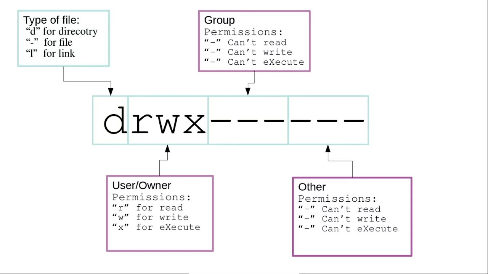

Welcome to my Linux command documentation! This repository contains all the essential Linux commands I've learned so far during my DevOps journey. I'll keep adding new commands and their explanations as I continue to learn and explore more about Linux.
🚀 If you find the project useful, give it a ⭐! Pull requests are always welcome. For more tech insights, follow me @Sangangouda-Patil. Let's build together! 💻

## Table of Contents

| # | Section | Description |
|---|---------|-------------|
| 1 | [Basic Questions On Linux](#basic-questions-on-linux) | Fundamental Linux concepts and questions. |
| 2 | [Important Directories In Linux](#important-directories-in-linux) | Overview of key directories in Linux. |
| 3 | [User Information](#user-information) | Commands for managing user information. |
| 4 | [File And Directory Commands](#file-and-directory-commands) | Commands for file and directory management. |
| 5 | [File Permissions](#file-permissions) | Understanding and managing file permissions. |
| 6 | [Search And Replace](#search-and-replace) | Tools for searching and replacing text. |
| 7 | [Networking Commands](#networking-commands) | Essential networking commands. |
| 8 | [Sudo and Installing Packages](#sudo-and-installing-packages) | Managing packages and using sudo. |
| 9 | [System And Hardware Information](#system-and-hardware-information) | Commands for system and hardware info. |
| 10 | [Disk Usage](#disk-usage) | Checking disk usage. |
| 11 | [Users And Groups](#users-and-groups) | Managing users and groups. |
| 12 | [Services And Process Management](#services-and-process-management) | Managing services and processes. |
| 13 | [Archiving And Unzipping Files](#archiving-and-unzipping-files) | Commands for archiving and unzipping. |
| 14 | [SSH Commands](#ssh-commands) | Secure Shell commands. |
| 15 | [Vi/Vim Commands](#vi-vim-commands) | Text editing with Vi/Vim. |
| 16 | [History Command](#history-command) | Using the history command. |
| 17 | [Curl Command](#curl-command) | Data transfer with curl. |
| 18 | [Note From Me ❤](#note-from-me) | Personal note and contributions. |

## Basic Questions on Linux

1. **What is Linux?**

   Linux is an open-source operating system that is widely used for servers, desktops, and embedded systems. It is known for its stability, security, and flexibility, making it a preferred choice for developers, IT professionals, and enterprises.

2. **What are the advantages of using Linux over other operating systems?**

   Linux offers numerous advantages such as:
   - Open-source and free to use.
   - Highly customizable.
   - Strong security features (better control over system permissions and user access).
   - A large community that supports development and troubleshooting.
   - Reliable performance for servers, especially under heavy loads.

3. **What is the Linux file system hierarchy?**

   Understanding the file system hierarchy (/, /home, /var, /etc, etc.) helps in navigating and managing Linux systems effectively. It's a crucial part of Linux system administration and is essential for file management, permissions, and system organization.

4. **What is a terminal in Linux, and why is it important?**

   The terminal (or shell) allows users to interact with the operating system using text-based commands. It provides a fast, efficient, and powerful way to execute tasks, from file management to system configurations, making it essential for system administrators and developers.

5. **What is the difference between sudo and su in Linux?**

   The `sudo` command is used to execute commands with superuser (root) privileges for specific tasks, while `su` switches the current user to the root account. Understanding the distinction between the two helps maintain security and proper privilege management in a Linux environment.

6. **What are package managers in Linux, and why are they used?**

   Package managers like `apt`, `yum`, `dnf`, or `pacman` allow users to install, update, and remove software packages in an organized and efficient manner. They simplify the management of software dependencies and updates, making system maintenance much easier.

### Principles of Linux

- Everything is a file inside Linux (including the hardware).
- Small single-purpose programs.
- Ability to chain these small programs together for complex tasks.
- Avoids Captive User Interface.
- Configuration data is stored in text files, allowing easy editing of settings.

### Most Used Linux Distros

- **RPM-based**: RHEL, CentOS, Oracle Linux, etc.
- **Debian-based**: Ubuntu, Kali Linux, etc.

The major difference is in the packaging method of software.

## Important Directories

a) **Home Directory**  
   `/root`, `/home/username`  
   Stores personal files and user-specific configurations.

b) **User Executable Binaries**  
   `/bin`, `/usr/bin`, `/usr/local/bin`  
   Contains essential user commands and executable programs.

c) **System Administrator Executable Binaries**  
   `/sbin`, `/usr/sbin`, `/usr/local/sbin`  
   Houses administrative commands used mainly by the root user.

d) **Mount Points for External Devices**  
   `/media`, `/mnt`  
   Directories for mounting external storage devices like USB drives or DVDs.

e) **Configuration Files**  
   `/etc`  
   Stores system-wide configuration files and service settings.

f) **Temporary Files**  
   `/tmp`  
   Holds temporary files created by system processes and applications.

g) **Kernel and Bootloader Files**  
   `/boot`  
   Contains boot-related files like kernels, initrd images, and bootloaders.

h) **Server Data**  
   `/var/srv`  
   Stores data and content served by services like web and FTP servers.

i) **System and Kernel Information**  
   `/proc`, `/sys`  
   Provides real-time system and kernel information via virtual filesystems.

j) **Shared Libraries**  
   `/lib`, `/usr/lib`, `/usr/local/lib`  
   Contains shared library files required by system binaries and applications.
   

## User Information

1. **whoami**: It displays the system's username.

   ```bash
   $ whoami
   sam
   ```
  
2. **id**: It displays the user identification (the real and effective user and group IDs) information.

   ```bash
   $ id
   uid=2002(sam) gid=2002(sam) groups=2002(sam),10(admin),20(dialout),30(audio),40(video)
   ```

3.  **who**: It is used to get information about currently logged-in users on the system. If you don't provide any option or arguments, the command displays the following information for each logged-in user.
   - Login name of the user
   - User terminal
   - Date & Time of login
   - Remote host name of the user

   ```bash
   $ who
   sam  :0 2023-10-05 10:30 (:0)
   ```
   

4. **groups**: This command is used to display all the groups to which the user belongs.

   ```bash
   $ groups
   sam: sam, admin, dialout, audio, video, deepak
   ```

5. **finger**: Used to check the information of any currently logged-in users. It displays users' login time, tty (name), idle time, home directory, shell name, etc.

   ```bash
   $ finger
   Login     Name       Tty      Idle  Login Time   Office     Office Phone
   sam       Sam        pts/2          Apr  30 11:25
   ```

   To install:
   ```bash
   $ sudo apt or yum install finger
   ```

6. **users**: Displays usernames of all users currently logged on the system.

   ```bash
   $ users
   sam
   ```

7. **grep**: It is a powerful pattern searching tool to find information about a specific user from the system accounts file: `/etc/passwd`.

   ```bash
   $ grep -i sam /etc/passwd
   sam:x:2002:2002:Sam,,,:/home/sam:/bin/bash
   ```

8. **w**: It is a command-line utility that displays information about currently logged-in users and what each user is doing.

   ```bash
   $ w
   10:45:00 up  1:30,  1 user,  load average: 0.15, 0.10, 0.05
   USER     TTY      FROM             LOGIN@   IDLE   JCPU   PCPU WHAT
   sam      pts/2    :0               10:30   0.10s  0.20s  0.05s /bin/bash
   ```

9. **last** or **lastb**: Displays a list of last logged-in users on the system. You can pass usernames to display their login and hostname details.

   ```bash
   $ last
   sam      pts/2        :0               Wed Apr 30 11:25   still logged in
   reboot   system boot  5.4.0-29-generic Wed Apr 30 11:25   still running
   ```

10. **lastlog**: The lastlog command is used to find the details of a recent login of all users or of a given user.

   ```bash
   $ lastlog

   Username         Port     From             Latest
   root                                       **Never logged in**
   sam              pts/2    :0               Wed Apr 30 11:28
   ```

## File and Directory Commands

1. **pwd**: Prints the full path of the current working directory.

   ```bash
   $ pwd
   /home/sam/Documents/Work
   ```

2. **ls**: Lists files and directories in the current directory, with options to modify the output.

   ```bash
   $ ls
   reports  scripts  data  README.md

   # Listing files & directories with time in reverse order
   $ ls -ltr
   drwxr-xr-x 2 sam sam 4096 Oct  5  2023 Backups
   drwxr-xr-x 2 sam sam 4096 Oct  5  2023 Configs
   drwxr-xr-x 2 sam sam 4096 Oct  5  2023 Archives

   # Home directory
   $ ls ~
   Documents  Downloads  Music  Pictures  Videos
   ```

   Options for `ls`:
   - `-a`: Include hidden files
   - `-R`: List directories recursively
   - `-r`: Reverse the order
   - `-t`: Sort by modification time
   - `-S`: Sort by file size
   - `-l`: Detailed listing
   - `-1`: One entry per line
   - `-m`: Comma-separated output
   - `-Q`: Quote the output

3. **mkdir**: Creates new directories.

   ```bash
   $ mkdir projects
   $ ls
   projects
   ```

   Use `-p` to create nested directories.

   ```bash
   $ mkdir -p dev/test/code
   $ cd dev/test/code
   ~/Documents/dev/test/code$
   ```

4. **rmdir**: Removes empty directories safely.

   ```bash
   # Remove empty directory
   $ rmdir old_folder

   # Remove multiple directories
   $ rmdir temp1 temp2 temp3

   # Remove entire directory tree
   $ rmdir -p a/b/c
   ```

5. **rm**: Deletes files and directories.

   ```bash
   # Remove file
   $ rm old_file.txt

   # Remove file forcefully
   $ rm -f important_file.txt

   # Remove directory
   $ rm -r old_directory

   # Remove directory forcefully
   $ rm -rf critical_directory
   ```

6. **touch**: Creates empty files or updates timestamps.

   ```bash
   # Create a new file
   $ touch new_file.txt

   # Create multiple files
   $ touch file1.txt file2.txt file3.txt

   # Change access time
   $ touch -a access_file.txt

   # Change modification time
   $ touch -m modify_file.txt

   # Use timestamp of another file
   $ touch -r source_file.txt target_file.txt

   # Create file with specific time
   $ touch -t 202310051200 specific_time_file.txt
   ```

7. **cat**: Concatenates and displays file content.

   ```bash
   # Create a file
   $ cat > notes.txt
   This is a new note.

   # View file contents
   $ cat notes.txt

   # More & Less options
   $ cat large_file.txt | more
   $ cat large_file.txt | less
   ```

   8. **vi, vim**: Text editors to create and edit files. `vim` is the improved version of `vi`, commonly preferred.

   ```bash
   # Open a file with vi
   $ vi file.txt

   # Open a file with vim
   $ vim file.txt
   ```

## File Permissions

Linux is a multi-user operating system, so it's necessary to provide security to prevent unauthorized access to files. Authorization is divided into two levels:

### Ownership

Each file or directory has three types of owners:
- **User**: The owner of the file who created it.
- **Group**: A group of users with the same access permissions.
- **Other**: All other users on the system.

### Permissions

Each file or directory has the following permissions for the above owners:
- **Read (r)**: Allows opening and reading a file or listing its contents for a directory.
- **Write (w)**: Allows modifying the contents of a file and managing files in a directory.
- **Execute (x)**: Allows running a program in Unix/Linux.

Permissions are indicated by:
- `r` = read permission
- `w` = write permission
- `x` = execute permission
- `-` = no permission

The above authorization levels represented in a diagram format



### Changing Access

The `chmod` command is used to change the access mode of a file. It sets permissions (read, write, execute) for the owner, group, and others.

```bash
chmod [reference][operator][mode] file...
```

**Example:**
```bash
chmod ugo-rwx test.txt
```

#### Absolute Mode

Permissions are represented in a three-digit octal number:

| Permission Type       | Number | Symbol |
|-----------------------|--------|--------|
| No Permission         | 0      | ---    |
| Execute               | 1      | --x    |
| Write                 | 2      | -w-    |
| Execute + Write       | 3      | -wx    |
| Read                  | 4      | r--    |
| Read + Execute        | 5      | r-x    |
| Read + Write          | 6      | rw-    |
| Read + Write + Execute| 7      | rwx    |

**Example:**
```bash
chmod 764 test.txt
```

#### Symbolic Mode

Modify permissions of a specific owner:

- **Owners:**
  - `u`: user/owner
  - `g`: group
  - `o`: other
  - `a`: all

- **Operators:**
  - `+`: Adds permission
  - `-`: Removes permission
  - `=`: Assigns permission

### Changing Ownership and Group

Change the ownership and group of a file/directory using `chown`:

```bash
chown user filename
chown user:group filename
```

**Example:**
```bash
chown sam test.txt
chown sam:admin test.txt
```

#### Change Group-Owner Only

Use `chgrp` to change the group owner only:

```bash
chgrp group_name filename
```

**Example:**
```bash
sudo chgrp developers test.txt
```

## Search and Replace Commands

1. **grep**: Search inside files.

   ```bash
   $ grep "searchword" file.txt
   ```

   - **Recursive Search**: Search within files in a directory and its subdirectories.
     ```bash
     $ grep -r "searchword" /path/to/directory
     ```

   - **List Matching Files**: List file names containing the search word.
     ```bash
     $ grep -l "searchword" *.txt
     ```

   - **Case-Insensitive Search**: Perform a case-insensitive search.
     ```bash
     $ grep -i "searchword" file.txt
     ```

   - **Inverse Search**: Exclude lines containing the search word.
     ```bash
     $ grep -v "searchword" file.txt
     ```

   - **Limit Search to File Types**: Search only specific file types.
     ```bash
     $ grep --include="*.txt" -r "searchword" /path/to/directory
     ```

2. **find**: Locate files based on name, size, date.

   ```bash
   $ find /home -name "*.txt"
   ```

   - **Search and Execute**: Use `find` with `exec` to search and execute commands.
     ```bash
     $ find /path/to/directory -name "*.txt" -exec sed -i 's/oldword/newword/g' {} \;
     ```

3. **locate**: Fast file search using a database.

   ```bash
   $ locate filename.txt
   ```

4. **sed**: Search and replace directly in files.

   ```bash
   $ sed -i 's/oldword/newword/g' file.txt
   ```

   - **In vim/vi**: Search and replace in the whole file.
     ```vim
     :%s/oldword/newword/g
     ```

5. **awk**: Pattern scanning and processing, similar to `grep`.

   ```bash
   $ awk '{if($1 == "searchword") print $0}' file.txt
   ```

6. **perl**: Search and replace operations in files with regular expressions.

   ```bash
   $ perl -pi -e 's/oldword/newword/g' file.txt
   ```

7. **diff**: Compare two files to see differences.

   ```bash
   $ diff file1.txt file2.txt
   ```

## Networking Commands

1. **ifconfig**: Displays all network information, including IP addresses and ports.

   ```bash
   ifconfig -a
   ```

2. **ping**: Sends an echo request to test the connection to a remote machine.

   ```bash
   ping 10.0.0.11
   ping hostname.com
   ```

3. **hostname -I**: Displays the IP address of the current machine.

   ```bash
   hostname -I
   ```

4. **ip addr show**: Displays IP address and network interface information.

   ```bash
   ip addr show
   ```

5. **netstat -pnltu**: Displays active or listening ports on the system.

   ```bash
   netstat -pnltu
   ```

6. **whois**: Provides information about a domain, such as the owner and contact details.

   ```bash
   whois google.com
   ```

7. **traceroute**: Shows the path data packets take to a remote machine.

   ```bash
   traceroute google.com
   ```

8. **nslookup**: Queries the DNS to find information about domain names and IP addresses.

   ```bash
   nslookup google.com
   ```

9. **dig**: A DNS lookup tool that provides detailed information.

   ```bash
   dig google.com
   ```

10. **route**: Displays or modifies the IP routing table.

    ```bash
    route -n
    ```

11. **ss**: Investigates sockets, similar to netstat but faster and with more features.

    ```bash
    ss -tuln
    ```

12. **curl**: Transfers data from or to a server, often used to test APIs and HTTP/HTTPS requests.

    ```bash
    curl -I google.com
    ```

13. **ip link show**: Displays detailed information about network interfaces.

    ```bash
    ip link show
    ```

14. **mtr**: Combines ping and traceroute for continuous network testing and route analysis.

    ```bash
    mtr google.com
    ```

15. **arp**: Displays or manipulates the system's ARP cache.

    ```bash
    arp -a
    ```

16. **iptables**: Configures and manages Linux firewall rules, essential for network security.

    ```bash
    sudo iptables -L
    ```

## Sudo and Installing Packages

### Debian-based (Ubuntu, etc.)

1. **sudo apt update**: Update repository information.

   ```bash
   sudo apt update
   ```

2. **sudo apt upgrade**: Upgrade installed packages.

   ```bash
   sudo apt upgrade
   ```

3. **sudo apt install package-name**: Install a package.

   ```bash
   sudo apt install nginx
   ```

4. **sudo apt remove package-name**: Remove a package.

   ```bash
   sudo apt remove nginx
   ```

5. **dpkg -i package.deb**: Install a `.deb` file manually.

   ```bash
   sudo dpkg -i package-name.deb
   ```

### RPM-based (RHEL, CentOS, Fedora)

1. **yum install package-name**: Install packages using YUM (older tool).

   ```bash
   sudo yum install nginx
   ```

2. **dnf install package-name**: Install packages using DNF (newer YUM replacement).

   ```bash
   sudo dnf install nginx
   ```

3. **rpm -i package.rpm**: Install `.rpm` package manually.

   ```bash
   sudo rpm -i package-name.rpm
   ```

### Additional Commands

1. **yum info package-name**: Display brief details about a package.

   ```bash
   yum info package_name
   ```

2. **yum remove package-name**: Uninstall a package.

   ```bash
   yum remove package_name
   ```

3. **Install from local file**: Install package from a local `.rpm` file.

   ```bash
   rpm -i package_name.rpm
   ```

4. **Install from source code**: Compile and install from source.

   ```bash
   tar zxvf sourcecode.tar.gz
   cd sourcecode
   ./configure
   make
   make install
   ```

## System and Hardware Information

1. **uname -a**: Print all system information.

   ```bash
   $ uname -a
   ```

2. **uname -s**: Print the kernel name.

   ```bash
   $ uname -s
   ```

3. **uname -r**: Print the kernel release.

   ```bash
   $ uname -r
   ```

4. **uname -m**: Print the system architecture.

   ```bash
   $ uname -m
   ```

5. **uname -o**: Print the operating system.

   ```bash
   $ uname -o
   ```

6. **arch**: Display the architecture of the system.

   ```bash
   $ arch
   ```

## Disk Usage

The `du` command is used to check the disk usage of files and directories on a machine.

### Synopsis

```bash
du [OPTION]... [FILE]...
```

1. **Disk usage of a directory**: Find the disk usage summary of a directory and its subdirectories.

   ```bash
   du /home/
   ```

2. **Disk usage in human-readable format**: Display disk usage in a human-readable format (e.g., KB, MB).

   ```bash
   du -h /home/
   ```

3. **Total disk usage of a directory**: Show the total disk usage of a directory.

   ```bash
   du -sh /home/
   ```

4. **Total disk usage of all files and directories**: Display the total disk usage of files and directories.

   ```bash
   du -ah /home/
   ```

5. **Total disk usage up to a certain depth**: Print the total for a directory only if it is N or fewer levels below the command.

   ```bash
   du -ah --max-depth=2 /home/
   ```

6. **Total disk usage with excluded files**: Exclude files that match a given pattern from the disk usage calculation.

   ```bash
   du -ah --exclude="*.txt" /home/
   ```

7. **Help**: Display information about the `du` command.

   ```bash
   du --help
   ```

## Users and Groups

1. **adduser, useradd**: Create a new user. `adduser` is more user-friendly, while `useradd` is more basic and configurable.

   ```bash
   sudo adduser newuser
   ```

2. **usermod**: Modify an existing user's details (such as adding to a group).

   ```bash
   sudo usermod -aG groupname username
   ```

3. **passwd**: Change a user's password.

   ```bash
   passwd username
   ```

4. **groupadd**: Create a new group.

   ```bash
   sudo groupadd groupname
   ```

5. **groupdel**: Delete a group.

   ```bash
   sudo groupdel groupname
   ```

6. **gpasswd**: Administer the `/etc/group` file. Can be used to set a password for a group.

   ```bash
   sudo gpasswd groupname
   ```

7. **deluser, userdel**: Delete a user. `deluser` is more user-friendly, while `userdel` is more configurable.

   ```bash
   sudo userdel username
   ```

8. **delgroup, groupdel**: Delete a group. Similar to `groupdel` but can sometimes vary depending on the distribution.

   ```bash
   sudo groupdel groupname
   ```

9. **chage**: Change user password expiry information (e.g., password expiration date).

   ```bash
   sudo chage -l username
   ```

10. **getent**: Retrieve entries from databases like passwd or group.

    ```bash
    getent passwd username
    ```

11. **Edit /etc/passwd**: The `/etc/passwd` file contains user account information. This file can be manually edited to create or modify users (not recommended unless necessary).

    ```bash
    sudo vi /etc/passwd
    ```

12. **Edit /etc/group**: The `/etc/group` file contains group account information. You can manually edit this file to add/remove users from groups.

    ```bash
    sudo vi /etc/group
    ```

## Process Management

1. **top**: Displays real-time system information, including processes, memory usage, and CPU usage.

   ```bash
   top
   ```

2. **htop**: An improved, interactive process viewer with a user-friendly interface.

   ```bash
   htop
   ```

   *Note: It may need to be installed via `sudo apt install htop`.*

3. **ps aux**: Displays all running processes in the BSD format.

   ```bash
   ps aux
   ```

4. **ps -ef**: Displays all running processes in the UNIX style, often considered more detailed.

   ```bash
   ps -ef
   ```

5. **kill PID**: Terminates a process using its Process ID (PID).

   ```bash
   kill 1234
   ```

6. **kill -9 PID**: Forcefully terminates a process, even if it's unresponsive.

   ```bash
   kill -9 1234
   ```

7. **pkill**: Terminates processes by name.

   ```bash
   pkill processname
   ```

8. **xkill**: Allows you to click on a window to kill the associated process.

   ```bash
   xkill
   ```

9. **nice**: Launches a process with a specified priority.

   ```bash
   nice -n 10 command_name
   ```

10. **renice**: Changes the priority of an already running process.

    ```bash
    renice 10 -p 1234
    ```

## Service Management

1. **systemctl start servicename**: Starts a service.

   ```bash
   sudo systemctl start nginx
   ```

2. **systemctl stop servicename**: Stops a service.

   ```bash
   sudo systemctl stop nginx
   ```

3. **systemctl restart servicename**: Restarts a service.

   ```bash
   sudo systemctl restart nginx
   ```

4. **systemctl reload servicename**: Reloads the configuration of a service without fully restarting it.

   ```bash
   sudo systemctl reload nginx
   ```

5. **systemctl status servicename**: Displays the status of a service.

   ```bash
   systemctl status nginx
   ```

6. **systemctl enable servicename**: Enables a service to start automatically at boot.

   ```bash
   sudo systemctl enable nginx
   ```

7. **systemctl disable servicename**: Disables a service from starting at boot.

   ```bash
   sudo systemctl disable nginx
   ```

8. **systemctl is-active servicename**: Checks whether a service is active.

   ```bash
   systemctl is-active nginx
   ```

9. **systemctl list-units --type=service**: Lists all active services.

   ```bash
   systemctl list-units --type=service
   ```

10. **service servicename start**: Starts a service (used in older SysVinit systems).

    ```bash
    sudo service nginx start
    ```

11. **service servicename stop**: Stops a service (used in older SysVinit systems).

    ```bash
    sudo service nginx stop
    ```

12. **service servicename status**: Displays the status of a service (used in older SysVinit systems).

    ```bash
    sudo service nginx status
    ```

## Additional Tools

1. **journalctl**: Displays logs for services managed by systemd.

   ```bash
   journalctl -u nginx
   ```

2. **systemd-analyze**: Analyzes boot-up performance and time taken by services during boot.

   ```bash
   systemd-analyze
   ```

3. **lsof**: Lists all open files, including network connections.

   ```bash
   lsof -i :80
   ```

4. **timeout**: Runs a command and kills it if it runs for longer than a specified time.

   ```bash
   timeout 30s some_command
   ```

5. **fuser**: Identifies which process is using a particular file or port.

   ```bash
   fuser -n tcp 80
   ```

## Archiving and Unzipping Files

### Using tar (Traditional method)

1. **tar -cvf archive.tar files/**: Create a tar archive.

   ```bash
   tar -cvf backup.tar /home/username/
   ```

2. **tar -xvf archive.tar**: Extract a tar archive.

   ```bash
   tar -xvf backup.tar
   ```

3. **tar -czvf archive.tar.gz files/**: Create a compressed tar.gz archive.

   ```bash
   tar -czvf backup.tar.gz /home/username/
   ```

4. **tar -xzvf archive.tar.gz**: Extract a compressed tar.gz archive.

   ```bash
   tar -xzvf backup.tar.gz
   ```

### Using zip/unzip (Modern and common method)

1. **zip filename.zip files/**: Create a zip archive.

   ```bash
   zip -r archive.zip folder/
   ```

2. **unzip filename.zip**: Extract a zip archive.

   ```bash
   unzip archive.zip
   ```

*Note: `zip/unzip` is often used in modern systems for better cross-platform compatibility.*

## SSH Commands

SSH (Secure Shell) is a network protocol that enables secure remote connections between two systems.

1. **Connect to a remote machine using IP address or hostname**: Establish a connection using the host name or IP address.

   ```bash
   ssh 192.168.1.100
   ssh example.server.com
   ```

2. **Connect to a remote machine using username**: Specify a user for an SSH connection.

   ```bash
   ssh john@192.168.1.100
   ssh john@example.server.com
   ```

3. **Connect to a remote machine using a custom port**: Specify a custom port for the SSH connection.

   ```bash
   ssh example.server.com -p 2222
   ```

4. **Generate SSH keys using keygen**: Create a key pair (public and private keys) for secure SSH connections.

   ```bash
   ssh-keygen -t rsa
   ```

5. **Copy SSH keys to servers**: Use `ssh-copy-id` to copy the public key to a server for authentication.

   ```bash
   ssh-copy-id john@192.168.1.100
   ```

6. **Copy a file remotely over SSH**: Use SCP to securely copy files over the SSH protocol.

   ```bash
   scp file.txt john@192.168.1.100:/home/john/Desktop
   ```

7. **Edit SSH config file**: Customize SSH server options by editing the `sshd_config` file.

   ```bash
   sudo vim /etc/ssh/sshd_config
   ```

8. **Run commands on a remote server**: Execute SSH commands on a remote machine from the local machine.

   ```bash
   ssh example.server.com mkdir NewDirectory
   ```

9. **Restart SSH service**: Restart the SSH service after making configuration changes.

   ```bash
   sudo systemctl restart ssh
   ```

   *or*

   ```bash
   sudo systemctl restart sshd
   ```

## Vi/Vim Commands

Vi is a classic text editor, while Vim (Vi IMproved) is an enhanced version used for text editing in the command line interface. It operates in two main modes:

- **Command Mode**: For entering commands to manipulate text.
- **Insert Mode**: For typing text into the file.

### Starting with Vi Editor

1. **Open or create a file**: Use `vi` to open an existing file or create a new one.

   ```bash
   vi filename.txt
   ```

   - **Create a new file named `first.txt`**:
     - Press `i` to enter insert mode.
     - Type "Hello World!"
     - Save and exit with `:wq!`.

### Cursor Movement

- **Move cursor**: Use arrow keys or:
  - `h` - Move left
  - `j` - Move down
  - `k` - Move up
  - `l` - Move right

- **Jump one word**:
  - `w` - Jump forward to the start of a word
  - `b` - Jump backward to the start of a word

- **Jump to start or end of a line**:
  - `^` - Jump to the start of the current line
  - `$` - Jump to the end of the current line

- **Paging and Scrolling**:
  - `Ctrl + f` - Move forward one full screen
  - `Ctrl + b` - Move backward one full screen

### Inserting Text

- **Insert**:
  - `i` - Insert text to the left of the cursor
  - `I` - Insert text at the beginning of a line

- **Append**:
  - `a` - Append text to the right of the cursor
  - `A` - Append text at the end of a line

- **Open a line**:
  - `o` - Open a line below the current cursor position
  - `O` - Open a line above the current cursor position

### Editing Text

- **Change word**: `cw` - Change word/part of word to the right of the cursor
- **Change line**: `cc` - Change the entire line
- **Change from cursor to end of line**: `C`

### Deleting Text

- **Delete one character**: `x` - Delete character under the cursor
- **Delete a word**: `dw` - Delete from the cursor to the end of the word
- **Delete a line**: `dd` - Delete the entire line

### Cut, Copy & Paste

- **Copy (Yank)**:
  - `yy` - Copy an entire line
  - `3yy` - Copy three lines
  - `yaw` - Copy a word with trailing whitespace

- **Cut (Delete)**:
  - `dd` - Cut the entire line
  - `3dd` - Cut three lines

- **Paste**: `p` - Paste the copied or cut text

### Visual Mode

- **Select text**:
  - `v` - Select individual characters
  - `V` - Select entire lines
  - `Ctrl+v` - Select by block

### Exiting

- **Save and exit**: `:wq`
- **Force save and exit**: `:wq!`
- **Quit without saving**: `:q!`

## History Command Options

The `history` command shows a list of previously issued commands. Here are some options to manage your command history:

| Option | Description |
|--------|-------------|
| **-c** | Clears the entire command history. |
| **-d offset** | Deletes the history entry at the specified offset. |
| **-a** | Appends the current session's history to the history file. |
| **-r** | Reads the history file and appends entries to the session. |
| **-n** | Prevents command numbers from being displayed. |
| **-w** | Writes the current session's history to the history file. |
| **-s** | Appends the specified entry to the end of the history list. |
| **-p offset** | Prints the history entry at the specified offset. |
| **-f file** | Reads history entries from the specified file. |

### Examples

1. **Clear the entire command history**:

   ```bash
   history -c
   ```

2. **Delete a specific history entry**:

   ```bash
   history -d <offset>
   ```

3. **Append current session's history to the history file**:

   ```bash
   history -a
   ```

4. **Read and append entries from the history file**:

   ```bash
   history -r
   ```

5. **Prevent command numbers from being displayed**:

   ```bash
   history -n
   ```

6. **Write current session's history to the history file**:

   ```bash
   history -w
   ```

7. **Append a specified entry to the history list**:

   ```bash
   history -s "<command>"
   ```

8. **Print a specific history entry**:

   ```bash
   history -p <offset>
   ```

9. **Read history entries from a specified file**:

   ```bash
   history -f <file>
   ```

## Curl Command

Curl is a command-line tool for transferring data to or from a server, supporting various protocols like HTTP, HTTPS, FTP, and more. It acts like a text-based web browser for Linux.

### Options

| Option | Description |
|--------|-------------|
| **-X, --request <command>** | Specify the HTTP request method (GET, POST, etc.). |
| **-H, --header <header>** | Pass custom headers to the request. |
| **--data <data>** | HTTP POST data. |
| **--data-urlencode <data>** | URL encode the POST data. |
| **--form <name=content>** | Specify multipart/form-data POST data. |
| **-d, --data-raw <data>** | Send data as-is without any encoding. |
| **-i, --include** | Include HTTP headers in the output. |
| **--url <url>** | Specify the URL to send the request to. |
| **-o, --output <file>** | Write output to a file instead of stdout. |
| **-O, --remote-name** | Save the file with the same name as in the URL. |
| **-L, --location** | Follow redirects. |
| **--user <user:password>** | Specify the user and password for server authentication. |
| **-u, --user-agent <agent>** | Set the user-agent string. |
| **--cookie <data>** | Send cookies from string/file. |
| **--cookie-jar <file>** | Save cookies to a file after receiving them. |
| **--compressed** | Request compressed response. |
| **-v, --verbose** | Make the operation more talkative for debugging. |
| **-h, --help** | Display help information. |

### Examples

1. **Basic GET Request**: Sends a simple GET request to the specified URL.

   ```bash
   curl http://example.com
   ```

2. **Specify Request Method**: Use a request method other than the default GET.

   ```bash
   curl -X POST http://example.com
   ```

3. **Include Headers**: Include custom headers in the request.

   ```bash
   curl -H "Content-Type: application/json" http://example.com
   ```

4. **Send POST Data**: Send data as a POST request payload.

   ```bash
   curl -X POST --data "key1=value1&key2=value2" http://example.com
   ```

5. **Save Output to File**: Write the output to a specified file.

   ```bash
   curl -o output.html http://example.com
   ```

6. **Download File**: Download a file and save it with the same name as in the URL.

   ```bash
   curl -O http://example.com/file.zip
   ```

### Wget Command

`wget` is another command-line utility for downloading files from the web, often used for its robustness in handling network issues.

- **Download a file**:

  ```bash
  wget http://example.com/file.zip
  ```

- **Download a file and save with a different name**:

  ```bash
  wget -O newname.zip http://example.com/file.zip
  ```

- **Download a file in the background**:

  ```bash
  wget -b http://example.com/file.zip
  ```

- **Resume a partially downloaded file**:

  ```bash
  wget -c http://example.com/file.zip
  ```

## Note From Me ❤

I hope this documentation has been helpful in starting your Linux journey. All these commands and descriptions
are from my personal learning experiences. If you have any suggestions or improvements, Pull Requests are highly
appreciated. Feel free to follow me for more updates and insights!

